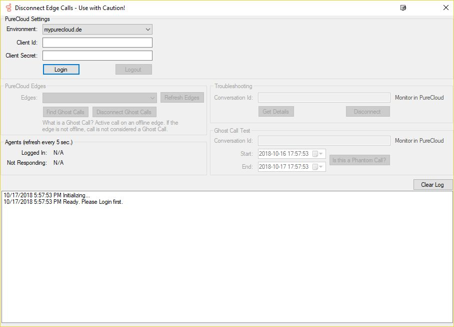

# PureCloud Disconnect Ghost Calls

This tool is used to disconnect *Ghost Calls* (calls that are stuck due to a critical failure in PureCloud).
This tool should *ONLY* be used when absolutely required.

> A `Ghost Call` is a call that is still active (showing as connected in PureCloud) while its edge is offline (disconnected from the network)

## Features

* Retrieve all calls that qualify as *Ghost Calls* (A call that is active on an offline edge)
* Disconnect *Ghost Calls*

## Limitations

* Only works for calls (voice conversations)

## Installation

### Requirements

* Windows 7+
* [.Net Framework 4.5.2](https://www.microsoft.com/en-us/download/details.aspx?id=42642)
* Admin rights to your local machine
* Access to PureCloud (https://*.mypurecloud.*)
* An OAuth Client Credentials client id & client secret

## User Guide

* Setup
  * Download the [setup](https://github.com/PierrickI3/DisconnectGhostCalls/releases/download/1.0/PC.Ghost.Call.Tool.Setup.msi) file and follow the wizard
  * Double-click on the Desktop icon to get started
* Logging in
  * Open the app
  * Select your environment
  * Enter your Client Id & Client Secret
  * Click on the `Login` button. You should see a note in the text field about an `Access Token`
* Finding Ghost Calls
  * Select an offline edge
  * Click on `Find Ghost Calls`
  * The `Log` field will indicate how many *Ghost Calls* were found
  * Click on `Disconnect Ghost Calls` to disconnect those calls

## I don't want to take this responsibility!

The application does its best at finding calls that are still active on an offline edge.
To help you understand if there is indeed an issue with your PureCloud organization, we have added extra items:

### Agent stats

Agent stats show the number of `Logged in` agents and the number of agents in a `Not Responding` status. This refreshes every 5 seconds. 

If you see the number of `Not Responding` agents increasing, this means that PureCloud is alerting agents with a call it can't control. 

> You need to act!

### Troubleshooting

The `Troubleshooting` section is here to help you query a few things about specific conversations:

* Enter a conversation id
* Click on `Get Details` to get the current state of the conversation. You can use this to analyze the `Participants`, `Sessions` and `Segments` on that conversation.

### Ghost Call Test

This section is to let you test whether a call is actually a *Ghost Call* by running the same logic the app uses when it tries to find *Ghost Calls* for you.
* Enter a conversation id
* Set the `Start` and `End` date/time controls in the range when this call was initiated
> If you do not know the start and end date/time, use the `Get Details` button above
* Click on `Is this a Ghost Call?` button and a new dialog will appear with whether or not it thinks this conversation is a `Ghost Call`
 